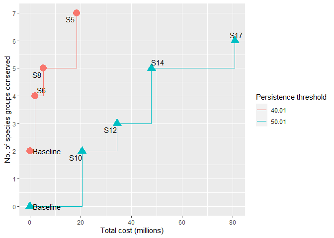

Optimize Management
================
Abbey Camaclang
15 Feb 2023

This code performs the complementarity analysis using the consOpt R
package developed by Nicolai Cryer <nkcryer@gmail.com> and updated by
Abbey Camaclang with a number of bug fixes.

Requires **ExpPerform_best.csv** from *expPerformance.R*, and the
**CostFeas.csv** table of cost and feasibility for each strategy. Also
requires a table **Combinations.csv** specifying which individual
strategies are in the combination strategies.

If using for the first time, need to install and load packages. Two ways
to build/install the consOpt package:

Method A

``` r
install.packages("remotes")
library("remotes")
install_github("ConservationDecisionsLab/consOpt")
```

OR Method B  
1) download/clone the github repository
<https://github.com/ConservationDecisionsLab/consOpt>  
2) open up RStudio and open the RProj file in the downloaded directory  
3) press “build and install” in the top right corner. This should
restart the R session and load the package.

May need to install/update Rtools, R/RStudio, or some of the required
packages - see DESCRIPTION file in the consOpt package for a list of
other required packages.

``` r
# Load packages
library(consOpt)
library(tidyverse)
library(cowplot)
library(here)

# Specify paths to subfolders within current working directory
input <- here("analysis", "data", "raw") # where raw data files are located
derived <- here("analysis", "data") # where compiled/summarized data are located
results <- here("analysis", "results") # where results of analysis should be saved
figures <- here("analysis", "figures") # where plots should be saved

# Read in and prep data
combos <- read.csv(paste0(input, "/Combinations.csv"), header = TRUE) # list of individual strategies that make up each strategy (in columns). Should have a column for baseline and all strategies
exp.perf <- read.csv(paste0(results, "/ExpPerform_all.csv"))
costfeas <- read.csv(paste0(derived, "/CostFeas.csv")) # estimated Cost and Feasibility for each Strategy (col 1), including Baseline
costs <- costfeas$Best.Cost
names(costs) <- costfeas$Strategy
```

Create expected performance matrix for complementarity analysis
(optimization)

``` r
perf.transposed <- exp.perf[,-1] %>%
  t() %>%
  data.frame() %>%
  setNames(exp.perf[,1]) %>%
  mutate(Est.type = rownames(.)) %>%
  separate(Est.type, c("Estimate", "Strategy"), sep = "[_]", remove = TRUE) %>%
  relocate(Estimate, Strategy) %>%
  remove_rownames()

best <- perf.transposed %>%
  filter(grepl("Best", Estimate)) %>%
  mutate(Estimate = NULL) %>%
  column_to_rownames("Strategy")

write.csv(best, paste0(results, "/ExpPerform_best.csv"), row.names = FALSE)
```

Sample performance matrix:

|          | Grassland species | Burrow and den species | Sand dune species | Wetland and shorebird species | Amphibians | Fish species | Healthy prairie landscape |
|----------|------------------:|-----------------------:|------------------:|------------------------------:|-----------:|-------------:|--------------------------:|
| Baseline |            45.500 |                 45.500 |          52.87500 |                      51.20253 |   50.55556 |     55.00000 |                  40.00000 |
| S1       |            57.660 |                 54.588 |          61.03500 |                      57.64304 |   58.73333 |     59.11429 |                  54.22222 |
| S2       |            49.682 |                 46.775 |          53.95875 |                      52.46139 |   53.95556 |     55.00000 |                  43.51333 |
| S3       |            51.938 |                 47.128 |          57.68500 |                      52.70127 |   51.37778 |     55.00000 |                  46.57778 |
| S4       |            47.180 |                 45.332 |          52.87500 |                      56.66785 |   59.40356 |     61.00000 |                  45.60000 |
| S5       |            58.376 |                 57.100 |          60.63250 |                      58.58835 |   61.51111 |     60.38571 |                  56.11111 |

### Find optimal strategies for most likely scenario (best guess estimates)

Run the optimization routine across the default budgets and thresholds.
For some sparse documentation, type ?Optimize

``` r
results.best <- Optimize(benefits.matrix = best, 
                    cost.vector = costs, 
                    combo.strategies = combos
                    , thresholds = c(50.01, 60.01)
                    )
```

    ## ====================================

``` r
write.csv(results.best, paste0(results, "/Complementarity_best.csv"), row.names = FALSE)
```

Sample output:

| total_cost | strategies | species_groups                                                                                                                                               | threshold | number_of_species | budget.max |
|-----------:|:-----------|:-------------------------------------------------------------------------------------------------------------------------------------------------------------|----------:|------------------:|-----------:|
|          0 | Baseline   | Sand dune species \| Wetland and shorebird species \| Amphibians \| Fish species                                                                             |     50.01 |                 4 |          0 |
|    2032309 | S6         | Grassland species \| Burrow and den species \| Healthy prairie landscape \| Sand dune species \| Wetland and shorebird species \| Amphibians \| Fish species |     50.01 |                 7 |    2032309 |
|          0 | Baseline   |                                                                                                                                                              |     60.01 |                 0 |          0 |
|    2032309 | S6         | Sand dune species                                                                                                                                            |     60.01 |                 1 |    2032309 |
|    6567385 | S4 + S6    | Sand dune species \| Fish species                                                                                                                            |     60.01 |                 2 |    6676627 |
|   18514291 | S5         | Sand dune species \| Amphibians \| Fish species                                                                                                              |     60.01 |                 3 |   18514291 |
|   20546600 | S10        | Grassland species \| Burrow and den species \| Sand dune species \| Amphibians \| Fish species                                                               |     60.01 |                 5 |   20546600 |
|   34433534 | S12        | Grassland species \| Burrow and den species \| Sand dune species \| Wetland and shorebird species \| Amphibians \| Fish species                              |     60.01 |                 6 |   34433534 |
|   47941570 | S14        | Grassland species \| Burrow and den species \| Sand dune species \| Wetland and shorebird species \| Amphibians \| Fish species \| Healthy prairie landscape |     60.01 |                 7 |   47941570 |

Plot using plotting function included in the consOpt package

``` r
optcurve.best <- PlotResults(results.best)
```

<!-- -->

OR create custom plot function (based on plotting function in the
package):

``` r
library(viridis)

PlotOptCurve <- function(summary.results, benefits.matrix, draw.labels=TRUE){
  
  tmp <- summary.results
  
  tmp$total_cost <- (tmp$total_cost / 10^6) # rescale x-axis to millions
  tmp$threshold <- round(tmp$threshold) # remove decimal points
  
  # Create plot object
  this.plot <- ggplot(tmp, aes(
    x = total_cost, 
    y = number_of_species, 
    group = threshold, 
    linetype = factor(threshold),
    shape = factor(threshold), 
    label = ifelse(strategies=="Baseline"," ",strategies)
  )
  ) +
    geom_step(
      # aes(color = factor(threshold)), 
      # size = 0.8,
      # alpha = 0.6
    ) +
    geom_point(
      # aes(color = factor(threshold)),
      size = 2
      # ,show.legend = FALSE
    ) +
    theme_cowplot() +
    theme(legend.justification = c(1,0),
          legend.position = c(0.95, 0.05),
          legend.key.height = unit(0.6,"cm"),
          legend.key.width = unit(1, "cm"),
          legend.title = element_text(size = 12),
          legend.text = element_text(size = 12),
          plot.margin = margin(0.5, 1, 0.5, 0.5, "cm")
          # legend.title.align=0.5
    ) +
    # scale_color_viridis(discrete=TRUE) +
    scale_y_continuous(
      # labels = function (x) floor(x), 
      breaks = min(tmp$number_of_species):length(benefits.matrix),
      limits = c(min(tmp$number_of_species), length(benefits.matrix))
    ) +
    labs(x = "Total cost (millions)", 
         y = "Number of groups secured"
         , linetype = "Persistence\nthreshold (%)"
         , shape = "Persistence\nthreshold (%)"
    )
  
  if(draw.labels){
    this.plot <- this.plot + 
      geom_text_repel(size = 4, 
                      hjust = "left", 
                      nudge_x = 0.5,
                      nudge_y = -0.15,
                      xlim = c(0, max(tmp$total_cost)+5), 
                      ylim = c(-0.5, max(tmp$number_of_species)+0.5), 
                      show.legend = FALSE
                      # , direction = "both"
      )
  }
  
  plot(this.plot)
  this.plot
}
```

Plot using custom function above

``` r
optcurve.best <- PlotOptCurve(results.best, best, draw.labels = TRUE)
```

    ## Warning: Removed 1 rows containing missing values (geom_text_repel).

<!-- -->

``` r
ggsave(paste0(figures, "/Complementarity_best.pdf"), optcurve.best, width = 180, height = 120, units = "mm")
# ggsave(paste0(figures, "/Complementarity_best.tiff"), optcurve.best, width = 120, height = 115, units = "mm", dpi = 600)
```

### Uncertainty analysis

Create expected performance matrices for lowest and highest estimates

``` r
low <- perf.transposed %>%
  filter(grepl("Low", Estimate)) %>%
  mutate(Estimate = NULL) %>%
  column_to_rownames("Strategy")

high <- perf.transposed %>%
  filter(grepl("High", Estimate)) %>%
  mutate(Estimate = NULL) %>%
  column_to_rownames("Strategy")

# write.csv(low, paste0(results, "/ExpPerform_low.csv"), row.names = FALSE) 
# write.csv(high, paste0(results, "/ExpPerform_high.csv"), row.names = FALSE) 
```

Run the optimization for the most pessimistic scenario (lowest
estimates) and the most optimistic scenario (highest estimates)

``` r
results.low <- Optimize(benefits.matrix = low,
                  cost.vector = costs,
                  combo.strategies = combos
                  , thresholds = c(40.01, 50.01)
                  )

results.high <- Optimize(benefits.matrix = high,
                  cost.vector = costs,
                  combo.strategies = combos
                  , thresholds = c(60.01, 70.01)
                  ) 

write.csv(results.low, paste0(results, "/Complementarity_low.csv"), row.names = FALSE)
write.csv(results.high, paste0(results, "/Complementarity_high.csv"), row.names = FALSE)
```

Plot the benefit curves for lowest and highest estimates

``` r
# Using plotting function included in the consOpt package:
optcurve.low <- PlotResults(results.low)
optcurve.high <- PlotResults(results.high)

# OR using the custom plot function above:
optcurve.low <- PlotOptCurve(results.low, low, draw.labels = TRUE)
optcurve.high <- PlotOptCurve(results.high, high, draw.labels = TRUE)

# Save plots as pdf or tiff files
ggsave(paste0(figures, "/Complementarity_low.pdf"), optcurve.low, width = 180, height = 120, units = "mm")
ggsave(paste0(figures, "/Complementarity_high.pdf"), optcurve.high, width = 180, height = 120, units = "mm")
# ggsave(paste0(figures, "/Complementarity_low.tiff"), optcurve.low, width = 120, height = 115, units = "mm", dpi = 600)
# ggsave(paste0(figures, "/Complementarity_high.tiff"), optcurve.high, width = 120, height = 115, units = "mm", dpi = 600)
```
