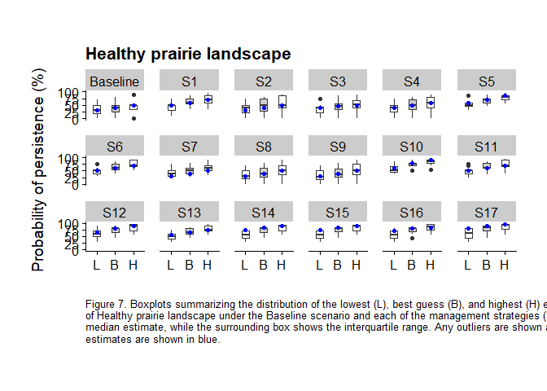
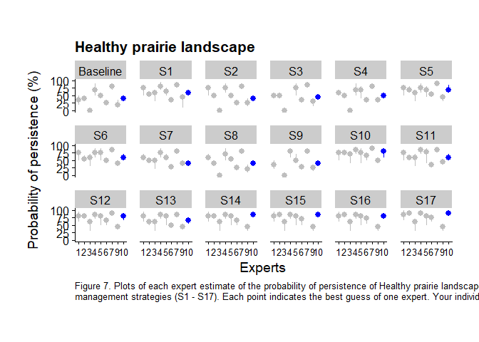

Plot Expert Estimates
================
Abbey Camaclang
02 Feb 2023

Based on *Boxplot_script.R* from Fraser River Estuary PTM project This
script creates two plots for each Ecological Group:  
1) boxplots of the best guess, lowest, and highest estimates for each
Strategy from all Experts;  
2) pointrange plots showing the best guess, lowest, and highest
estimates of each Expert for each Strategy.

It requires the output file **Estimates_tidy.csv** from *import.R*.

``` r
# Load packages
library(tidyverse)
library(cowplot)
library(gridExtra)
library(here)

# Specify paths to subfolders within current working (R project) directory
derived <- here("analysis", "data") # where compiled data tables are saved
results <- here("analysis", "results") # where results of analysis should be saved
figures <- here("analysis", "figures") # where plots should be saved

# Read in data
long <- read_csv(paste(derived,"/Estimates_tidy.csv", sep=""))

strat.levels <- unique(long$Strategy)
grp.levels <- unique(long$Ecological.Group)
expcode <- unique(long$Expert) 
est.levels <- c("Low", "Best", "High")

long$Strategy <- factor(long$Strategy, levels = strat.levels)
long$Estimate <- factor(long$Estimate, levels = est.levels)

long <- na.omit(long)
```

## Boxplots

Plot group estimates as boxplots

``` r
for (j in seq_along(expcode)) {
  
  grp.list <- list()
  
  # If you do not need to highlight each individual response, run the inside loop (below) only to get a single file
  for (i in seq_along(grp.levels)) { 
    
    temp.grpdata <- subset(long, Ecological.Group == grp.levels[i])
    
    temp.plot <-
      ggplot(temp.grpdata, aes(x = Estimate, # for each Ecological group, plot Estimate Type on x-axis 
                               y = Value, # and Value on y-axis, 
                               fill = Estimate) # and colour the boxplots by estimate type
             ) + 
      # geom_violin() +  # option to add a violin plot around the boxplot - if doing so, reduce boxplot width in next line
      geom_boxplot(width=0.4) + 
      geom_point(data = subset(temp.grpdata, Expert == expcode[j]), # plot expert [j]'s estimates as blue points 
                aes(x = Estimate, y = Value),
                color = 'blue'
                ) + # include the geom_point option only if you want to highlight individual expert responses
      theme_cowplot() +  # use the minimalist theme "cowplot" 
      theme(plot.margin = unit(c(1.5, 1, 1.5, 1), "cm"), # adjust margins around the outside of the plot (T, R, B, L)
            panel.spacing = unit(1, "lines"), # adjust margins and between panels of the plot (spacing of 1)
            axis.title.y = element_text(margin = margin(t = 0, 
                                                        r = 10,
                                                        b = 0,
                                                        l = 0) # adjust space bet. y-axis numbers and y-axis label
                                        ),
            plot.caption = element_text(size = 10, hjust = 0)
            ) + 
      facet_wrap( ~ Strategy, nrow = 3) +  # create a separate panel of estimates for each management strategy
      scale_x_discrete(name = "",
                       breaks = c("Low", "Best", "High"),
                       labels = c("L", "B", "H") # Give the x-axis variables shortened labels
                       ) + 
      scale_fill_manual(values = c("white", "gray80", "white"), # Assign colours to each type of estimate
                        guide = "none" # remove legend
                        ) + 
      labs(x = "", 
           y = "Probability of persistence (%)", 
           title = paste(grp.levels[i]),
           caption = str_wrap(paste0(
             "Figure ", i, ". Boxplots summarizing the distribution of the lowest (L), best guess (B), and highest (H) expert 
             estimates of the probability of persistence of ", grp.levels[i], " under the Baseline scenario and each of the 
             management strategies (S1 - S17). The thick horizontal lines indicate the median estimate, while the surrounding 
             box shows the interquartile range. Any outliers are shown as points beyond the plot whiskers. Your individual 
             estimates are shown in blue."), 150)
           ) +
     ylim(0, 100) # set the y-axis limits from 0-100

    grp.list[[i]] <- temp.plot
    
  }
  
  # Save all plots as a single .pdf: 
  plot1 <- marrangeGrob(grp.list, nrow = 1, ncol = 1, top = NULL) # one plot per page
  ggsave(
    # filename = "All_boxplot.pdf", # use instead of below if generating a single file with no highlighting
    filename = paste0("exp", expcode[j], "_boxplot.pdf", sep=''),
    plot1, 
    path = figures, 
    width = 11, height = 8.5, units = "in")
  
}

print(temp.plot)
```

<!-- -->

## Pointrange plots

Plots each expert estimate separately (x-axis = Expert, y-axis point =
Best guess, range = low-\>high)

``` r
# Rearrange table so estimates for each ecol group-strategy are on the same row
wide <- spread(long, key = Estimate, value = Value)
wide$Expert <- as.factor(wide$Expert)

# Create plots
for (j in seq_along(expcode)) {
  
  grp.list <- list()
  
  # If you do not need to highlight each individual response, run the inside loop (below) only to get a single file
  for (i in seq_along(grp.levels)) {
  
    temp.expdata <- subset(wide, Ecological.Group == grp.levels[i])
    temp.expdata <- mutate(temp.expdata, expi = ifelse(Expert == expcode[j], T, F)) # use only if highlighting individual expert responses
    
    temp.plot2 <-
      ggplot(temp.expdata, aes(x = Expert, # using the data Ecological group, plot Experts on X-axis
                               y = Best, # and corresponding standardized estimates on y-axis
                               color = expi, # use this only if highlighting individual expert responses
                               )
             ) +  
      geom_pointrange(aes(ymin = Low, ymax = High)) +
      theme_cowplot() +  
      theme(plot.margin = unit(c(1.5, 1, 1.5, 1), "cm"), # adjust margins around the outside of the plot
            panel.spacing = unit(1, "lines"), # adjust margins and between panels of the plot (spacing of 1)
            axis.title.y = element_text(margin = margin(t = 0,
                                                        r = 10,
                                                        b = 0,
                                                        l = 0)), # adjust space between y-axis numbers and y-axis label
            axis.text.x = element_text(size=10),
            legend.justification=c(1,0), legend.position=c(0.98,-0.05), # re-positions legend box
            plot.caption = element_text(size = 10, hjust = 0)
            ) +  
      scale_color_manual(values = c("grey", "blue"), guide = "none") + # only needed if highlighting individual expert responses
      facet_wrap( ~ Strategy, nrow = 3) +  # create a separate panel of estimates for each management strategy
      labs(x = "Experts",
           y = "Probability of persistence (%)",
           title = paste(grp.levels[i]),
           caption = str_wrap(paste0(
             "Figure ", i, ". Plots of each expert estimate of the probability of persistence of ", grp.levels[i], 
             " under the Baseline scenario and each of the management strategies (S1 - S17). Each point indicates 
             the best guess of one expert. Your individual estimates are plotted in blue."), 150)
           ) +
     ylim(0, 100) # set the y-axis limits from 0-100

    grp.list[[i]] <- temp.plot2
  }
  
  # Save all plots as a single .pdf: 
  plot2 <- marrangeGrob(grp.list, nrow = 1, ncol = 1, top = NULL) # one plot per page
  ggsave(
     # filename = "All_pointrange.pdf", # if plotting all estimates without highlighting
     filename = paste0("exp", expcode[j], "_pointrange.pdf", sep=''), # if highlighting individual expert estimates
     plot2, 
     path = figures, 
     width = 11, height = 8.5, units = "in"
     )
  
}

print(temp.plot2)
```

<!-- -->
