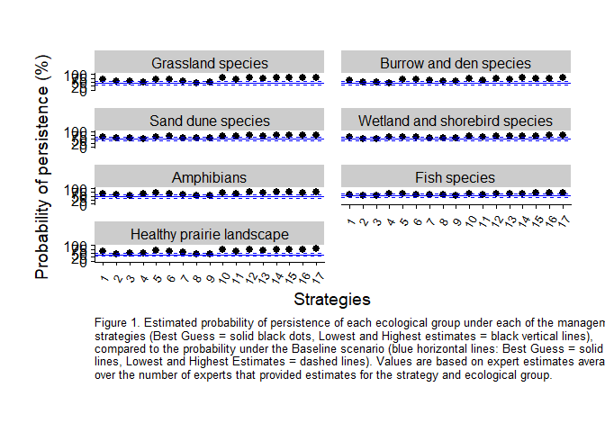

Plot Averaged Performance
================
Abbey Camaclang
02 Feb 2023

Creates pointrange plots of the aggregated estimates of probability of
persistence (y-axis) for each strategy (x-axis) and for each ecological
group (subplots).

It can be used to plot mean estimates that are either unweighted
(**Estimates_avg_persistence.csv** from *aggregate.R*) or weighted by
feasibility (**Expected_Performance.csv** from *getBenefitMatrix.r*)

``` r
# Load packages
library(tidyverse)
library(cowplot)
library(gridExtra)
library(here)

# Specify paths to subfolders within current working directory
results <- here("analysis", "results") # where results of analysis should be saved
figures <- here("analysis", "figures") # where plots should be saved

# Read in probability of persistence data
weighted <- 0 # (1) if values are weighted by feasibility, (0) if not

if (weighted == 0) {
  est.file <- "/Estimates_avg_persistence" # unweighted
} else {
  if (weighted == 1) {
    est.file <- "/Expected_Performance" # feasibility weighted
  } else {
    stop("Must specify if estimates are weighted by feasibility (1) or not (0)")
  }
}

persistence <- read_csv(paste0(results, est.file, ".csv"))
grp.levels <- unique(persistence$Ecological.Group)
persistence$Ecological.Group <- factor(persistence$Ecological.Group, levels = grp.levels)

# Organize data into correct format for plotting
persistence.long <- persistence %>%
  gather(., key = "Estimate", value = "Value", -Ecological.Group) %>%
  separate(., Estimate, c("Est.Type", "Strategy"), sep = "[_]", remove = TRUE) %>%
  mutate(Strategy = factor(Strategy, levels = unique(Strategy)))

plot.data <- persistence.long %>%
  spread(., 
         key = Est.Type, 
         value = Value)

strat.levels <- levels(plot.data$Strategy)

write_csv(plot.data, paste0(results, est.file, "_tidy.csv"))

baseline.data <- plot.data[which(plot.data$Strategy=="Baseline"),]
strategy.data <- plot.data[which(plot.data$Strategy!="Baseline"),]
```

Pointrange plots of averaged probability of persistence for each
ecological group

``` r
# Plot aggregated estimate of probability of persistence under each strategy
temp.plot2 <- 
  ggplot(strategy.data, aes(x = Strategy, y = Wt.Best) ) +
  geom_pointrange(aes(ymin = Wt.Low, ymax = Wt.High)) +
  geom_hline(aes(yintercept = Wt.Best), baseline.data, colour = "blue") +
  geom_hline(aes(yintercept = Wt.Low), baseline.data, colour = "blue", lty = "dashed") +
  geom_hline(aes(yintercept = Wt.High), baseline.data, colour = "blue", lty = "dashed") +
  theme_cowplot() +  # minimalist theme from cowplot package
  theme(plot.margin = unit(c(1.5, 1, 1.5, 1), "cm"), # top, right, bottom and left margins around the plot area
        panel.spacing = unit(1, "lines"), # adjust margins and between panels of the plot (spacing of 1)
        axis.title.y = element_text(margin = margin(t = 0, r = 10, b = 0, l = 0)), # adjust space between y-axis numbers and y-axis label
        axis.text.x = element_text(size = 10, angle = 60, hjust = 0.5, vjust = 0.5),
        plot.caption = element_text(size = 10, hjust = 0)
  ) +
  facet_wrap( ~ Ecological.Group, nrow = 4, ncol = 2) +  # create a separate panel for each ecological group
  scale_x_discrete(breaks = strat.levels, labels = c("B", 1:17) ) +
  labs(x = "Strategies",
       y = "Probability of persistence (%)"
       # , title = "Mean estimates" 
       , caption = str_wrap("Figure 1. Estimated probability of persistence of each ecological group under each of the 
       management strategies (Best Guess = solid black dots, Lowest and Highest estimates = black vertical lines),
       compared to the probability under the Baseline scenario (blue horizontal lines: Best Guess = solid lines, 
       Lowest and Highest Estimates = dashed lines). Values are based on expert estimates averaged over the 
       number of experts that provided estimates for the strategy and ecological group.", 100)
  ) +
  ylim(0, 100) 

# Save plot as pdf file
ggsave(filename=paste0(figures, est.file, "_plot.pdf"), 
       temp.plot2, 
       width = 8.5, height = 11, 
       units = "in")

print(temp.plot2)
```

<!-- -->
