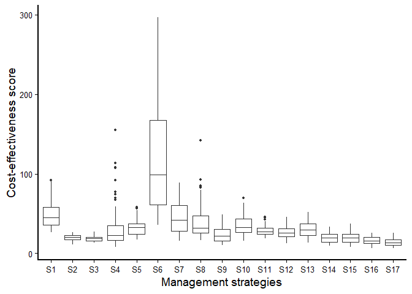
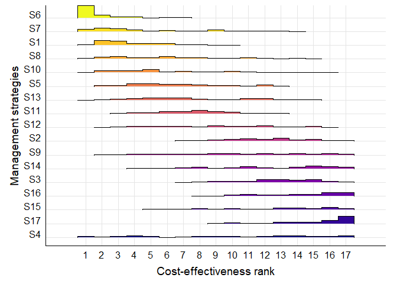

Uncertainty Analysis
================
Abbey Camaclang
11 Apr 2023

Generates `MC` random samples from range of uncertainty in benefit and
cost estimates, calculates cost-effectiveness (CE) scores for each rep,
and creates boxplots and ridgeplots to visualize variation in CE scores
and ranks resulting from uncertainty.

Needs:  
1) **Estimates_tidy.csv** from *import.R*,  
2) a .csv file **EcolGroupsList.csv** with ecological groups in columns
and the list of species for each group in rows,  
3) a .csv file **SpecialCases.csv** listing only the estimates (from
which expert, and for which ecol group and strategy) that require
different weighting, along with the number of species in that group that
the estimate is based on,  
4) **Benefits_total.rds** from *calculateCE.R*, and  
5) a table **CostFeas.csv** of strategy costs and feasibility.

``` r
# Load packages
library(tidyverse)
library(mc2d)
library(cowplot)
library(ggridges)
library(viridis)
library(here)

# Set parameters
a <- 10^6 # scaling to get cost and benefits in roughly the same order of magnitude
MC <-  100 # number of iterations (reps) for uncertainty analysis
u <- 0.3 # % variation (in costs) from the best estimate

# Specify paths to subfolders within current working directory
input <- here("analysis", "data", "raw") # where .csv files of benefit estimates are saved
derived <- here("analysis", "data") # where compiled data tables should be saved
results <- here("analysis", "results") # where results of analysis should be saved
figures <- here("analysis", "figures")
code <- here("analysis", "code")

# Load custom functions for calculating and weighting individual benefit estimates
source(paste0(code, "/ptmfunc.R"))
```

Import data

``` r
# Get cost & feasibility table
costfeas <- read.csv(paste0(derived, "/CostFeas.csv"))
costfeas$Strategy <- as_factor(costfeas$Strategy)
costfeas <- costfeas[-1,] # Remove baseline values

# Get table of individual expert estimates for sampling
long <- read.csv(paste0(derived, "/Estimates_tidy.csv"))

wide <- long %>%
  pivot_wider(names_from = Estimate, values_from = Value)
wide$Expert <- as_factor(wide$Expert)
wide$Ecological.Group <- as_factor(wide$Ecological.Group)
wide$Strategy <- as_factor(wide$Strategy)

# Get number of species in each group and number of species scored by each expert for each strategy
grplist <- read_csv(paste0(input, "/EcolGroupsList.csv")) # use read_csv() to keep spaces in column names
sppwts <- sum_spp(grplist)

# Get the number of species scored by each expert for each strategy
spcases <- read_csv(paste0(derived, "/SpecialCases.csv")) 
names(spcases)[which(str_detect(names(spcases), "Group") == 1)] <- "Ecological.Group"  

spcases$Strategy <- factor(spcases$Strategy, levels = levels(wide$Strategy))
spcases$Expert <- factor(spcases$Expert, levels = levels(wide$Expert))
spcases$Ecological.Group<- factor(spcases$Ecological.Group, 
                                  levels = levels(wide$Ecological.Group))

# Get (Best Guess) Benefits data from calculateCE.R
bestben.sum <- readRDS(paste0(results, "/Benefits_total.rds")) 
```

Load custom functions for plotting CE scores and ranks

``` r
boxplot.uncrtn <- function(scoredata) {
  
  CEscores <- scoredata %>%
    pivot_longer(-Strategy, names_to = "Iteration", values_to = "CE") %>%
    mutate(Strategy = factor(Strategy, levels = unique(scoredata$Strategy)))
  
  temp.plot <- ggplot(CEscores, 
                      aes(x = Strategy, y = CE)
                      ) +
    geom_boxplot(
      lwd = 0.3 #lwd changes line width
      , fatten = 1 # thickness of median line; default is 2
      , outlier.size = 1 # size of outlier point
      ) + 
    theme_cowplot() +  
    theme(
      axis.text = element_text(size = 10)
      , axis.line = element_line(size = 1)
      ) +
    scale_x_discrete(name = "Management strategies"
                     , breaks = levels(CEscores$Strategy)
                     , labels = levels(CEscores$Strategy)
                     ) +
    labs(x = "Management strategies"
         , y = "Cost-effectiveness score"
         ) #+
    # ylim(0, 200) 
}

rankfreq <- function(rankdata) {
  
  CEranks <- rankdata %>%
    pivot_longer(-Strategy, names_to = "Iteration", values_to = "CE_rank") %>%
    mutate(Strategy = factor(Strategy, levels = unique(rankdata$Strategy)))
  
  count_ranks <- xyTable(CEranks$Strategy, CEranks$CE_rank)
  rank_table <- data.frame(count_ranks$x, count_ranks$y, count_ranks$number)
  rank_table_sort <- as_tibble(rank_table)
  names(rank_table_sort) <- c("Strategy", "CE_rank", "Count")
  rank_table_sort <- group_by(rank_table_sort, Strategy) %>%
    filter(Count == max(Count)) %>%
    arrange(desc(CE_rank))
  
  strat.order <- rank_table_sort$Strategy
  stgyorder <- paste0("S", unique(strat.order))
  
  temp.plot.r <- ggplot(CEranks, 
                        aes(y = factor(Strategy, levels = stgyorder)
                            , x = CE_rank
                            , fill = factor(Strategy, levels = stgyorder)
                            )
                        ) +
    geom_density_ridges(stat = "binline", bins = length(stgyorder), scale = 0.9, draw_baseline = FALSE) +
    theme_ridges(grid = TRUE, center_axis_labels = TRUE) +
    theme(
      legend.position = "none"
      , panel.spacing = unit(0.1, "lines")
      , strip.text = element_text(size = 8)
      , axis.ticks = element_blank()
      , axis.line = element_line(size = 0.3)
      , panel.grid = element_line(size = 0.3)
      ) +
    scale_fill_viridis(option = "plasma", discrete = TRUE) +
    labs(x = "Cost-effectiveness rank"
         , y = "Management strategies"
         ) +
    scale_x_continuous(breaks = c(1:length(stgyorder))
                       , labels = c(1:length(stgyorder))
                       # , limits = c(0, max(rank_table$count_ranks.x)+1)
                       )
}
```

## Uncertainty analysis for cost-effectiveness (CE) scores

### Uncertainty in Benefit estimates

Generate MC samples and calculate Expected Benefits and CE scores for
each rep

``` r
samples_ben <- matrix(nrow = nrow(wide),ncol = MC)
MC.CEScore_ben <- list()

set.seed(1565)

for(it in 1:MC){
  
  # Sample benefit values from distribution provided by each expert
  samples_ben[,it] <- rpert(nrow(wide),
                        min = wide$Low,
                        mode = wide$Best,
                        max = wide$High, shape = 4)
  
  temp <- cbind(wide[,1:3], samples_ben[,it]) 
  names(temp)[4] <- "MC.Sample"
  
  # Calculate benefit for each MC sample set
  temp.wide <- pivot_wider(temp, names_from = Strategy, values_from = MC.Sample)
  temp.strat <- select(temp.wide, -Expert, -Ecological.Group, -Baseline) 
  
  temp.ben <- temp.strat - temp.wide$Baseline
  # temp.ben[temp.ben<0] <- 0 # replace negative benefit values with 0 (assume strategy has no benefit)
  temp.ben <- cbind(temp.wide[,1:2], temp.ben) 
  
  # Determine weights to assign based on number of species scored by each expert
  temp.long <- pivot_longer(temp.ben, -c(1:2), names_to = "Strategy", values_to = "Value") %>%
    mutate(Estimate = rep(c("Sample"), times = nrow(.)), .before = Value)
  temp.long$Strategy <- factor(temp.long$Strategy, levels = levels(wide$Strategy))
  
  temp.joined <- wt_species(temp.long, sppwts, spcases) # custom function
  
  # Calculate weighted average based on number of species scored by each expert
  temp.agg <- aggregate(temp.joined$Wt.Avg, 
                        by = list(Ecological.Group = temp.joined$Ecological.Group, 
                                  Strategy = temp.joined$Strategy), 
                        FUN = sum, na.rm = TRUE)
  
  # Weight (multiply) the averaged benefit by the number of species in group
  wt.temp.agg <- left_join(temp.agg, sppwts, by = "Ecological.Group") %>%
    mutate(Wt.Benefit = x*numspp)  # 'x' is the weighted average from above
  
  # Calculate (sum) total benefit of each strategy across all ecological groups
  sum.ben <- aggregate(wt.temp.agg$Wt.Benefit, 
                       by = list(Strategy = wt.temp.agg$Strategy),
                       FUN = sum, na.rm = TRUE)
  names(sum.ben)[2] <- "Benefit"
  
  # Calculate cost-effectiveness
  strat.est <- left_join(sum.ben, costfeas, by="Strategy") %>%
    mutate(sc.Cost = Best.Cost/a, # scale costs to get reasonable values
           Exp.Benefit = Benefit * Avg.Feas, # calculate expected benefit
           CE = (Benefit * Avg.Feas)/sc.Cost) # calculate cost-effectiveness score
  
  # Rank strategies by CE Score, Expected Benefit, and Cost
  CE_Score <- select(strat.est, c("Strategy", "Benefit", "Best.Cost", "Avg.Feas", "Exp.Benefit","CE")) %>%
    mutate(CE_rank = rank(-CE), 
           ExpBenefit_rank = rank(-Exp.Benefit), 
           Cost_rank = rank(Best.Cost))
  
  MC.CEScore_ben[[it]] <- CE_Score # save to list for plotting
  
} #end for
```

Compile results from all reps

``` r
MC.CETable_ben <- lapply(MC.CEScore_ben, "[", 1:length(strat.est$Strategy), "CE") 
MC.Results_ben <- matrix(unlist(MC.CETable_ben), ncol = MC, byrow = FALSE)
MC.Results_ben <- data.frame(strat.est$Strategy[1:length(strat.est$Strategy)], MC.Results_ben)
names(MC.Results_ben)[1] <- "Strategy"

MC.CERank_ben <- lapply(MC.CEScore_ben, "[", 1:length(strat.est$Strategy), "CE_rank")
MC.Ranks_ben <- matrix(unlist(MC.CERank_ben), ncol = MC, byrow = FALSE)
MC.Ranks_ben <- data.frame(strat.est$Strategy[1:length(strat.est$Strategy)], MC.Ranks_ben)
names(MC.Ranks_ben)[1] <- "Strategy"

MC.Samples_ben <- data.frame(wide[,1:3], samples_ben)

write_csv(MC.Results_ben, paste0(results, "/Uncertainty_CEScores_benefits.csv"))
write_csv(MC.Ranks_ben, paste0(results, "/Uncertainty_CERanks_benefits.csv"))
write_csv(MC.Samples_ben, paste0(derived, "/Uncertainty_SampledData_benefits.csv"))
```

Plot CE scores and ranks for benefit uncertainty

``` r
# Boxplots of CE scores, showing median and interquartile range of CE scores
# from each rep.
ben.boxplot <- boxplot.uncrtn(MC.Results_ben)

ggsave(filename=paste0(figures, "/Uncrtn_Ben_", MC, "reps_Scores.pdf", sep = ""), 
       ben.boxplot, width = 180, height = 180, units = "mm")
# ggsave(filename=paste0(figures, "/Uncrtn_Ben_", MC, "reps_Scores.tiff", sep = ""), 
#        ben.boxplot, width = 180, height = 180, units = "mm", dpi = 600)

# Ridgeplots of CE ranks, showing frequency (y-axis) that each strategy (rows) 
# is assigned a given CE rank (x-axis) based on its CE score from each rep.
ben.ranks <- rankfreq(MC.Ranks_ben)

ggsave(filename=paste0(figures, "/Uncrtn_Ben_", MC, "reps_Ranks.pdf", sep = ""), 
       ben.ranks, width = 180, height = 180, units = "mm")
# ggsave(filename=paste0(figures, "/Uncrtn_Ben_", MC, "reps_Ranks.tiff", sep = ""), 
#        ben.ranks, width = 180, height = 180, units = "mm", dpi = 600)
```

Sample plots

``` r
ben.boxplot
```

<!-- -->

``` r
ben.ranks
```

<!-- -->

### Uncertainty in cost estimates

``` r
# Get range of uncertainty in cost estimates
minidx <- grep("min.cost", names(costfeas), ignore.case = TRUE)
if (is_empty(minidx) == 0) {
  min.Cost <- costfeas[,minidx]
  best.Cost <- costfeas[,grep("best.cost", names(costfeas), ignore.case = TRUE)]
} else {
  min.Cost <- costfeas$Cost * (1-u)
  best.Cost <- costfeas$Cost
}

maxidx <- grep("max.cost", names(costfeas), ignore.case = TRUE)
if (is_empty(maxidx) == 0) {
  max.Cost <- costfeas[,maxidx]
} else {
  max.Cost <- costfeas$Best.Cost * (1+u)
}
```

Generate MC samples of Cost and calculate CE for each rep

``` r
samples <- matrix(nrow = nrow(costfeas),ncol = MC)
MC.CEScore_cost <- list()

set.seed(3279)

for (it in 1:MC) {
  
  # sample cost values
  samples[,it] <- rpert(nrow(costfeas),
                        min = min.Cost,
                        mode = best.Cost,
                        max = max.Cost, shape = 4)
  costfeas.mc <- costfeas %>%
    mutate(Sampled.Cost = samples[,it])
  
  # Join with benefits table (need to get this from the CE script, probably bestben.sum) and calculate cost-effectiveness
  strat.est <- full_join(bestben.sum, costfeas.mc , by = "Strategy") %>%
    mutate(Sc.Cost = Sampled.Cost/a, # scale costs to get reasonable values
           Exp.Benefit = Benefit * Avg.Feas, # weight benefits
           CE = (Benefit * Avg.Feas)/Sc.Cost) # calculate cost-effectiveness scores
  
  # Rank strategies by (weighted)Benefit, Cost, and CE score
  CE_Score <- select(strat.est, c("Strategy", "Benefit", "Sampled.Cost", "Avg.Feas", "Exp.Benefit","CE")) %>%
    mutate(CE_rank = rank(-CE),
           ExpBenefit_rank = rank(-Exp.Benefit),
           Cost_rank = rank(Sampled.Cost))
  
  MC.CEScore_cost[[it]] <- CE_Score
  
} # end for
```

Compile results from all reps

``` r
MC.CETable_cost <- lapply(MC.CEScore_cost, "[", 1:length(strat.est$Strategy), "CE")
MC.Results_cost <- matrix(unlist(MC.CETable_cost), ncol = MC, byrow = FALSE)
MC.Results_cost <- data.frame(strat.est$Strategy, MC.Results_cost)
names(MC.Results_cost)[1] <- "Strategy"

MC.CERank_cost <- lapply(MC.CEScore_cost, "[", 1:length(strat.est$Strategy), "CE_rank")
MC.Ranks_cost <- matrix(unlist(MC.CERank_cost), ncol = MC, byrow = FALSE)
MC.Ranks_cost <- data.frame(strat.est$Strategy, MC.Ranks_cost)
names(MC.Ranks_cost)[1] <- "Strategy"

MC.Samples_cost <- data.frame(costfeas$Strategy, samples)

write_csv(MC.Results_cost, paste0(results, "/Uncertainty_CEScores_cost.csv"))
write_csv(MC.Ranks_cost, paste0(results, "/Uncertainty_CERanks_cost.csv"))
write_csv(MC.Samples_cost, paste0(derived, "/Uncertainty_SampledData_cost.csv"))
```

Plot CE scores and ranks for cost uncertainty

``` r
# Boxplots of CE scores
cost.boxplot <- boxplot.uncrtn(MC.Results_cost)

ggsave(filename = paste0(figures, "/Uncrtn_Cost_", MC, "reps_Scores.pdf", sep = ""), 
       cost.boxplot, width = 180, height = 115, units = "mm")
# ggsave(filename=paste0(figures, "/Uncrtn_Cost_", MC, "reps_Scores.tiff", sep = ""), 
#        cost.boxplot, width = 180, height = 115, units = "mm", dpi = 600)

# Ridgeplots of CE ranks, showing frequency (y-axis) that each strategy (rows) 
# is assigned a given CE rank (x-axis) based on its CE score from each rep.
cost.ranks <- rankfreq(MC.Ranks_cost)

ggsave(filename=paste0(figures, "/Uncrtn_Cost_", MC, "reps_Ranks.pdf", sep = ""), 
       cost.ranks, width = 180, height = 180, units = "mm")
# ggsave(filename=paste0(figures, "/Uncrtn_Cost_", MC, "reps_Ranks.tiff", sep = ""), 
#        cost.ranks, width = 180, height = 180, units = "mm", dpi = 600)
```

Sample plots

``` r
cost.boxplot
```

<!-- -->

``` r
cost.ranks
```

<!-- -->
